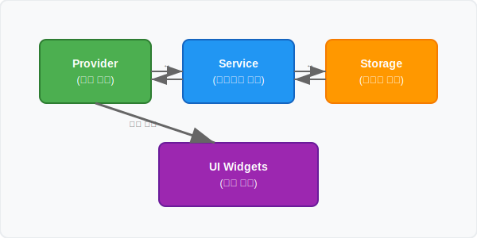

# 🍅 Fomato 프로젝트 가이드 (신입 개발자용)

## 📋 개요

**Fomato**는 토마토 농장 컨셉의 뽀모도로 타이머 앱입니다. 25분 집중 시간을 완료할 때마다 토마토 1개를 수확하는 게이미피케이션 요소가 특징입니다.

### 🎯 핵심 개념
- **농장(Farm)**: 프로젝트나 할 일을 그룹화하는 단위 (예: "Flutter 공부", "운동하기")
- **토마토 수확**: 25분 집중 완료 시 토마토 1개 획득
- **뽀모도로 기법**: 집중(25분) → 짧은 휴식(5분) → 반복, 4라운드마다 긴 휴식(15분)

---



## 🔍 코드 분석 단계별 가이드

새로운 개발자가 코드를 분석할 때 어디서부터 시작해야 할지 막막할 수 있습니다. 다음 단계를 따라 체계적으로 분석해보세요.

### 📋 1단계: 프로젝트 진입점 이해하기

**시작 파일**: `lib/main.dart`
```dart
void main() async {
  // 1. 앱 초기화 확인
  WidgetsFlutterBinding.ensureInitialized();
  
  // 2. 서비스 초기화 순서 파악
  await NotificationService().initialize();
  await BackgroundService.instance.initialize();
  
  // 3. Riverpod으로 상태 관리 시작
  runApp(const ProviderScope(child: FomatoApp()));
}
```

**🎯 분석 포인트:**
- 어떤 서비스들이 앱 시작 시 초기화되는가?
- ProviderScope가 어떻게 전체 앱을 감싸는가?

### 📋 2단계: 네비게이션 구조 파악하기

**핵심 파일**: `lib/widgets/bottom_navigation.dart`
```dart
class MainBottomNavigation extends StatefulWidget {
  final List<Widget> _screens = [
    const TimerScreen(),    // 0번: 메인 타이머
    const FarmScreen(),     // 1번: 농장 관리
    const StatisticsScreen(), // 2번: 통계
    const SettingsScreen(), // 3번: 설정
  ];
}
```

**🎯 분석 포인트:**
- 4개의 주요 화면이 어떻게 구성되어 있는가?
- IndexedStack으로 화면 전환이 어떻게 구현되는가?

### 📋 3단계: 핵심 데이터 모델 이해하기

**우선순위 순서로 분석:**

#### 3-1. TimerState (`lib/models/timer_state.dart`)
```dart
class TimerState {
  final TimerMode mode;        // focus, shortBreak, longBreak
  final TimerStatus status;    // initial, running, paused, completed
  final int remainingSeconds;  // 남은 시간
  final int currentRound;      // 현재 라운드 (1-4)
  final String? selectedFarmId; // 연결된 농장
}
```

**🔍 중요 메서드들:**
- `get progress`: 진행률 계산 (0.0~1.0)
- `get formattedTime`: MM:SS 형식 변환
- `copyWith()`: 불변 객체 업데이트 패턴

#### 3-2. Farm (`lib/models/farm.dart`)
```dart
class Farm {
  final String id;         // 고유 식별자
  final String name;       // "Flutter 공부"
  final int tomatoCount;   // 수확한 토마토
  
  Farm addTomato() {       // 토마토 추가 메서드
    return copyWith(tomatoCount: tomatoCount + 1);
  }
}
```

### 📋 4단계: 상태 관리 Provider 분석하기

**분석 순서:**

#### 4-1. TimerProvider (`lib/providers/timer_provider.dart`)
```dart
class TimerNotifier extends StateNotifier<TimerState> {
  // 🔥 가장 중요한 메서드
  void _handleModeCompletion(TimerState newState) {
    if (newState.status != TimerStatus.completed) return;
    
    // 집중 모드 완료 시 토마토 수확
    if (newState.mode == TimerMode.focus) {
      _harvestTomato(); // ← 핵심 로직!
    }
  }
}
```

**🎯 분석 포인트:**
- 타이머 완료 감지 → 토마토 수확 → 다음 모드 전환 흐름
- 백그라운드/포그라운드 전환 처리 (`didChangeAppLifecycleState`)
- 중복 처리 방지 로직 (`_lastCompletedTime`)

#### 4-2. FarmProvider (`lib/providers/farm_provider.dart`)
```dart
class FarmListNotifier extends StateNotifier<List<Farm>> {
  void harvestTomato(String farmId) {
    state = state.map((farm) {
      if (farm.id == farmId) {
        return farm.addTomato(); // ← 여기서 토마토 +1
      }
      return farm;
    }).toList();
  }
}
```

### 📋 5단계: 핵심 비즈니스 로직 분석하기

**가장 중요한 파일**: `lib/services/timer_service.dart`

#### 5-1. 타이머 시작 로직 추적
```dart
void start() {
  _currentMode = TimerMode.focus;
  _remainingSeconds = _focusMinutes * 60;
  _timer = Timer.periodic(Duration(seconds: 1), _tick);
}

void _tick(Timer timer) {
  _remainingSeconds--;
  if (_remainingSeconds <= 0) {
    _onModeCompleted(); // ← 완료 처리
  }
}
```

#### 5-2. 백그라운드 복원 로직 (⭐ 복잡하지만 중요!)
```dart
Future<void> restoreState() async {
  // 1. 저장된 상태 로드
  final savedState = await StorageService.loadTimerState();
  
  // 2. 백그라운드에서 경과된 시간 계산
  final elapsed = DateTime.now().difference(savedState.startTime);
  
  // 3. 남은 시간에서 경과 시간 차감
  _remainingSeconds = savedState.remainingSeconds - elapsed.inSeconds;
  
  // 4. 완료된 경우 처리
  if (_remainingSeconds <= 0) {
    _handleBackgroundCompletion();
  }
}
```

### 📋 6단계: 데이터 저장/로드 분석하기

**파일**: `lib/services/storage_service.dart`

```dart
class StorageService {
  // JSON 직렬화로 복잡한 객체 저장
  static Future<void> saveTimerState(TimerState state) async {
    final json = state.toJson();
    await _prefs.setString('timer_state', jsonEncode(json));
  }
  
  static Future<TimerState?> loadTimerState() async {
    final jsonString = _prefs.getString('timer_state');
    final json = jsonDecode(jsonString);
    return TimerState.fromJson(json);
  }
}
```

### 📋 7단계: UI와 상태 연결 분석하기

**예시**: `lib/screens/timer_screen.dart`

```dart
class TimerScreen extends ConsumerWidget {
  @override
  Widget build(BuildContext context, WidgetRef ref) {
    // 1. 상태 구독
    final timerState = ref.watch(timerProvider);
    
    // 2. 상태에 따른 UI 업데이트
    return CircularProgressIndicator(
      value: timerState.progress, // ← 진행률 반영
    );
    
    // 3. 사용자 액션 → Provider 호출
    onPressed: () => ref.read(timerProvider.notifier).start(),
  }
}
```

---

## 🎯 코드 분석 실습 체크리스트

각 단계를 완료했는지 체크해보세요:

- [ ] **1단계**: main.dart에서 앱 초기화 과정 이해
- [ ] **2단계**: 4개 화면 구조와 네비게이션 파악
- [ ] **3단계**: TimerState와 Farm 모델의 핵심 필드와 메서드 이해
- [ ] **4단계**: TimerProvider의 _handleModeCompletion 로직 추적
- [ ] **5단계**: TimerService의 start → _tick → 완료 처리 흐름 파악
- [ ] **6단계**: SharedPreferences를 통한 데이터 저장/복원 방식 이해
- [ ] **7단계**: UI에서 ref.watch와 ref.read 사용 패턴 파악

---

## 💡 분석할 때 유용한 팁

### 🔍 VS Code에서 코드 탐색
- `Ctrl+Click`: 메서드/클래스 정의로 이동
- `Ctrl+Shift+F`: 전체 프로젝트에서 텍스트 검색
- `F12`: Go to Definition
- `Shift+F12`: Find All References

### 📝 분석 노트 작성 권장사항
```
📁 timer_service.dart 분석
- start() → _tick() → _onModeCompleted() 흐름
- _remainingSeconds가 핵심 상태값
- Timer.periodic으로 1초마다 업데이트
- 질문: 백그라운드에서 어떻게 시간을 계산하지? 
  → restoreState() 메서드에서 처리!
```

### 🐛 디버깅으로 이해하기
```dart
// 중요한 지점에 print 추가해보기
void _handleModeCompletion(TimerState newState) {
  print('🔥 Mode completed: ${newState.mode}, Status: ${newState.status}');
  if (newState.mode == TimerMode.focus) {
    print('🍅 Harvesting tomato!');
    _harvestTomato();
  }
}
```

---

## 🏗️ 아키텍처 개요

### 상태 관리: Flutter Riverpod
이 프로젝트는 **Riverpod**을 사용한 상태 관리 패턴을 따릅니다.


### 주요 상태 흐름
1. **타이머 시작** → 시간 감소 → 25분 완료 → 토마토 수확 → 다음 모드로 전환
2. **농장 선택** → 타이머와 연동 → 통계 필터링 적용
3. **설정 변경** → 전체 앱에 즉시 반영

---

## 📁 프로젝트 구조

```
lib/
├── main.dart                      # 앱 진입점 및 초기화
├── models/                        # 데이터 모델
│   ├── farm.dart                 # 농장 모델 (이름, 색상, 토마토 개수)
│   ├── timer_state.dart          # 타이머 상태 모델 (모드, 시간, 라운드)
│   ├── statistics.dart           # 통계 데이터 모델
│   └── task.dart                 # 할일 모델
├── providers/                     # Riverpod 상태 관리
│   ├── timer_provider.dart       # 타이머 상태 및 로직
│   ├── farm_provider.dart        # 농장 목록 및 선택
│   ├── statistics_provider.dart  # 통계 데이터 관리
│   └── settings_provider.dart    # 앱 설정 관리
├── services/                      # 비즈니스 로직 서비스
│   ├── timer_service.dart        # 타이머 핵심 로직
│   ├── storage_service.dart      # SharedPreferences 데이터 저장
│   ├── notification_service.dart # 로컬 알림 처리
│   └── background_service.dart   # 백그라운드 실행 관리
├── screens/                       # 화면 위젯
│   ├── timer_screen.dart         # 타이머 화면 (메인)
│   ├── farm_screen.dart          # 농장 관리 화면
│   ├── statistics_screen.dart    # 통계 및 캘린더 화면
│   └── settings_screen.dart      # 설정 화면
├── widgets/                       # 재사용 가능한 위젯
│   ├── bottom_navigation.dart    # 하단 네비게이션 바
│   └── daily_detail_dialog.dart  # 일별 상세 통계 다이얼로그
└── utils/                         # 유틸리티 및 상수
    ├── constants.dart            # 앱 전역 상수
    └── theme.dart                # UI 테마 설정
```

---

## 🔄 핵심 컴포넌트 이해

### 1. TimerService (`lib/services/timer_service.dart`)
**역할**: 타이머의 모든 비즈니스 로직을 처리하는 핵심 서비스

```dart
class TimerService {
  // 핵심 메서드들
  void start();    // 타이머 시작
  void pause();    // 일시정지
  void resume();   // 재시작
  void stop();     // 정지
  void nextMode(); // 다음 모드로 전환 (집중→휴식→집중...)
}
```

**중요한 개념들**:
- `TimerMode`: focus(집중), shortBreak(짧은휴식), longBreak(긴휴식), stopped(정지)
- `TimerStatus`: initial(초기), running(실행중), paused(일시정지), completed(완료)
- **백그라운드 복원**: 앱이 백그라운드에서 돌아와도 정확한 시간 계산

### 2. TimerProvider (`lib/providers/timer_provider.dart`)
**역할**: TimerService와 UI를 연결하는 상태 관리 레이어

```dart
class TimerNotifier extends StateNotifier<TimerState> {
  // 주요 기능
  void _handleModeCompletion(TimerState newState) {
    // 집중 모드 완료 시 토마토 수확 처리
    if (newState.mode == TimerMode.focus) {
      _harvestTomato(); // 농장과 통계에 토마토 추가
    }
  }
}
```

**핵심 로직**:
- 모드 완료 감지 → 토마토 수확 → 자동 모드 전환
- 앱 생명주기 관리 (백그라운드/포그라운드 전환)
- 중복 처리 방지 (2초 내 중복 완료 무시)

### 3. Farm 시스템
**Farm 모델** (`lib/models/farm.dart`):
```dart
class Farm {
  final String id;           // 고유 식별자
  final String name;         // 농장 이름 ("Flutter 공부")
  final String color;        // 농장 색상 (#4CAF50)
  final int tomatoCount;     // 수확한 토마토 개수
  final DateTime createdAt;  // 생성 시간
  final DateTime updatedAt;  // 마지막 업데이트 시간
}
```

**FarmProvider** (`lib/providers/farm_provider.dart`):
```dart
class FarmListNotifier extends StateNotifier<List<Farm>> {
  void harvestTomato(String farmId) {
    // 특정 농장에 토마토 1개 추가
  }
}

class SelectedFarmNotifier extends StateNotifier<Farm?> {
  // 현재 선택된 농장 관리
  // 타이머와 연동되어 수확 대상 농장 결정
}
```

---

## 📊 데이터 플로우

### 1. 타이머 시작부터 토마토 수확까지

```
1. 사용자가 타이머 시작 버튼 클릭
   ↓
2. TimerProvider.start() 호출
   ↓
3. TimerService가 25분(1500초) 카운트다운 시작
   ↓
4. 매 초마다 TimerState 업데이트 → UI 리렌더링
   ↓
5. 0초 도달 → status가 completed로 변경
   ↓
6. TimerProvider._handleModeCompletion() 감지
   ↓
7. 집중 모드인 경우:
   - FarmProvider.harvestTomato() 호출 (농장에 토마토 +1)
   - StatisticsProvider.recordTomatoHarvest() 호출 (통계 기록)
   - 알림 전송 (NotificationService)
   ↓
8. 0.5초 후 자동으로 다음 모드(휴식)로 전환
```

### 2. 상태 저장 및 복원

```
저장 (앱이 백그라운드로 갈 때):
- SharedPreferences에 현재 타이머 상태 저장
- 농장 목록, 선택된 농장, 설정값 저장

복원 (앱이 포그라운드로 올 때):
- 저장된 시간과 현재 시간 비교
- 백그라운드에서 경과된 시간만큼 차감
- 완료된 모드가 있다면 토마토 수확 처리
```

---

## 🔧 주요 설정값

### AppConstants (`lib/utils/constants.dart`)
```dart
class AppConstants {
  // 기본 타이머 설정
  static const int defaultFocusMinutes = 25;      // 집중 시간
  static const int defaultShortBreakMinutes = 5;  // 짧은 휴식
  static const int defaultLongBreakMinutes = 15;  // 긴 휴식
  static const int defaultRoundsUntilLongBreak = 4; // 긴 휴식까지 라운드
  
  // 개발자 모드 (디버그용)
  static const int debugFocusSeconds = 5;         // 5초 집중 모드
  static const int debugBreakSeconds = 3;         // 3초 휴식 모드
}
```

### 설정 변경 시 주의사항
- 타이머가 실행 중이거나 일시정지 상태일 때는 설정 변경 불가
- 설정 변경 후 기존 타이머는 새 설정으로 초기화됨

---

## 🎨 UI/UX 특징

### 디자인 컨셉
- **미니멀 화이트톤**: 깔끔하고 집중하기 좋은 환경
- **토마토 테마**: 귀여운 농장 컨셉으로 동기부여
- **직관적 네비게이션**: 4개 탭으로 간단한 구조

### 색상 시스템 (`lib/utils/theme.dart`)
```dart
class AppTheme {
  static const Color primary = Color(0xFF4CAF50);     // 메인 녹색
  static const Color secondary = Color(0xFFFFC107);   // 포인트 노란색
  static const Color background = Color(0xFFFFFFFF);  // 배경 흰색
  static const Color surface = Color(0xFFF7F7F7);     // 카드 배경
}
```

---

## 📱 주요 화면 구성

### 1. 타이머 화면 (`TimerScreen`)
- **원형 진행바**: 남은 시간 시각적 표시
- **모드 표시**: Focus, Short Break, Long Break
- **라운드 진행도**: ● ○ ○ ○ (현재/전체)
- **컨트롤 버튼**: 시작/정지/일시정지

### 2. 농장 화면 (`FarmScreen`)
- **농장 목록**: 카드 형태로 농장별 정보 표시
- **토마토 카운트**: 수확한 토마토 개수
- **농장 관리**: 추가/수정/삭제 기능

### 3. 통계 화면 (`StatisticsScreen`)
- **캘린더 뷰**: 월별 토마토 수확 현황
- **필터링**: 전체/특정 농장별 통계
- **상세 보기**: 날짜 클릭 시 해당일 활동 내역

### 4. 설정 화면 (`SettingsScreen`)
- **타이머 설정**: 집중/휴식 시간, 라운드 수
- **알림 설정**: 완료 알림 on/off
- **기타 설정**: 테마, 사운드 등

---

## 🚀 개발 시작하기

### 1. 환경 설정
```bash
# 의존성 설치
flutter pub get

# 앱 실행
flutter run

# 코드 분석
flutter analyze

# 테스트 실행
flutter test
```

### 2. 디버그 모드 사용법
개발 중에는 5초/3초 타이머를 사용할 수 있습니다:

```dart
// lib/utils/constants.dart에서 설정
static const int debugFocusSeconds = 5;     // 집중 5초
static const int debugBreakSeconds = 3;     // 휴식 3초
```

### 3. 새로운 기능 추가 가이드

**새 화면 추가 시**:
1. `lib/screens/` 에 화면 파일 생성
2. `lib/widgets/bottom_navigation.dart` 에 탭 추가
3. 필요시 Provider 생성 후 `main.dart`에 등록

**새 설정 추가 시**:
1. `lib/providers/settings_provider.dart` 에 설정 항목 추가
2. `lib/services/storage_service.dart` 에 저장/로드 로직 추가
3. `lib/screens/settings_screen.dart` 에 UI 추가

---

## ⚠️ 주요 주의사항

### 1. 상태 관리
- Riverpod의 상태는 불변(immutable)이므로 항상 `copyWith()` 사용
- UI에서 직접 상태 변경 금지, 반드시 Provider를 통해서만 변경

### 2. 타이머 로직
- 백그라운드/포그라운드 전환 시 시간 계산 정확성 중요
- 중복 완료 처리 방지 로직 유지 (2초 내 중복 무시)
- 플랫폼별 알림 처리 차이 고려 (Android vs iOS)

### 3. 데이터 저장
- SharedPreferences 사용 시 try-catch로 에러 처리 필수
- JSON 직렬화/역직렬화 시 타입 안전성 확인

---

## 🛠️ 트러블슈팅

### 자주 발생하는 문제들

**Q: 백그라운드에서 돌아왔을 때 시간이 부정확해요**
A: `TimerService.restoreState()` 메서드에서 시간 계산 로직을 확인하세요.

**Q: 토마토가 중복으로 수확되어요**
A: `_lastCompletedTime` 기반 중복 방지 로직이 정상 동작하는지 확인하세요.

**Q: 설정을 변경했는데 반영이 안 돼요**
A: 타이머가 실행 중인 상태에서는 설정 변경이 금지됩니다. 타이머를 정지 후 변경하세요.

**Q: 농장 선택이 타이머와 연동이 안 돼요**
A: `TimerProvider`의 농장 선택 리스너가 정상 동작하는지 확인하세요.

---

## 📚 추가 학습 자료

- **Flutter 공식 문서**: https://flutter.dev/docs
- **Riverpod 가이드**: https://riverpod.dev/docs/introduction/getting_started
- **뽀모도로 기법**: https://en.wikipedia.org/wiki/Pomodoro_Technique

---

## 💡 개발 팁

1. **로그 활용**: `kDebugMode`와 함께 적절한 디버그 로그 추가
2. **상태 추적**: Flutter Inspector로 위젯 트리 및 상태 변화 모니터링
3. **핫 리로드**: 코드 변경 후 `r` 키로 빠른 테스트
4. **에뮬레이터**: Android/iOS 모두에서 테스트하여 플랫폼 차이 확인

---

이 가이드를 통해 Fomato 프로젝트의 구조와 핵심 로직을 이해하고, 효율적으로 개발을 시작할 수 있기를 바랍니다! 🚀